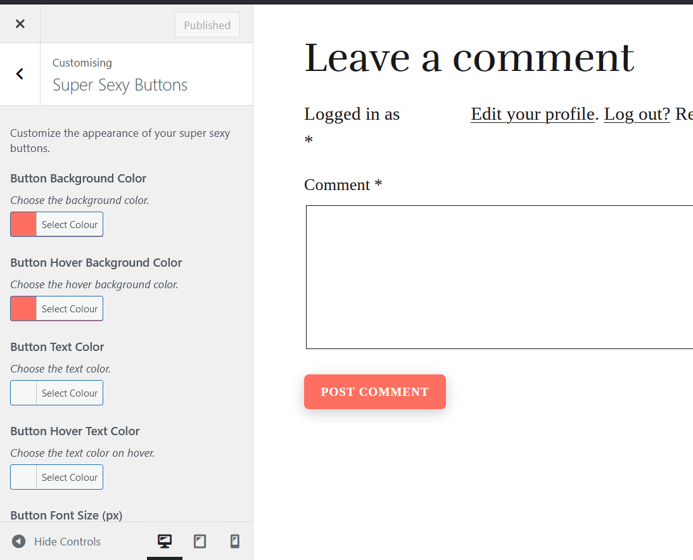

# Super Sexy Custom Buttons
###### WordPress Plugins by Volkan Sah
### You need bling bling? You get bling bling! 💎✨

## What is This?

Are you fed up with those boring, flat, lifeless buttons that seem to mock your every design effort? Ever find yourself knee-deep in code, muttering "WTF" as you try to make a button pop, only to realize you're about to break your whole site? Yeah, I've been there too.

You just want to make a few buttons look awesome—why should that require a degree in rocket science, right? All you wanted was a bit of bling, some sparkle, maybe even a touch of sass. But no, they tell you to load up massive plugins, create child themes, or, God forbid, write your own CSS! All that for three little buttons? Seriously?!

Enter **Super Sexy Custom Buttons**—the plugin that understands your pain and delivers the bling-bling without the WTF. No more drowning in options you don't need. No more endless coding sessions just to make your "Continue Reading", "Post Comment", and "Reply" buttons look as fabulous as you know they should.

Say goodbye to dull and drab, and hello to fabulously flashy! 💅 Your buttons will finally get the attention they deserve, and all it takes is a few clicks. Because life’s too short for ugly buttons, and you deserve better. You deserve bling bling 😄

## Features

- **Custom Background Colors:** Choose your button background color—any color you like! Add a splash of personality with your favorite hues.
- **Hover Background Colors:** Set a different color for when the button is hovered over. Keep it surprising, keep it sexy!
- **Custom Text Colors:** Choose separate text colors for both the button's default state and its hover state.
- **Font Size & Text Transform:** Customize the size of your button text in pixels, and choose whether you want it in uppercase, lowercase, or capitalized.
- **Border Radius Control:** Perfect those corners with our smooth slider, from sharp 0px to luscious 50px.
- **Automatic `!important` CSS:** Don’t worry about pesky themes or other plugins trying to dull your sparkle. We’ve got your back with some serious `!important` magic. Your buttons will outshine anything else on the page!
- **Super Sexy Hover Effect:** Watch as your buttons gently rise and shine when hovered over. That’s right, your buttons don’t just sit there—they make an entrance! Smooth, sexy, and oh-so-stylish.
- **Targeted Bling:** This plugin specifically targets your "Continue Reading" links and the all-important "Post Comment" and "Reply" buttons. These are the buttons that matter most, and now they’ll look better than ever!
- **Real-time Preview:** Watch your buttons transform in real-time within the WordPress Customizer. No more guesswork—only pure, unfiltered glamour.

## Installation

1. Upload the plugin files to the `/wp-content/plugins/super-sexy-custom-buttons` directory, or install the plugin through the WordPress plugins screen directly.
2. Activate the plugin through the 'Plugins' screen in WordPress.
3. Go to Appearance > Customize > **Super Sexy Custom Buttons** and start blinging your buttons!

## How to Use

1. **Choose Your Bling:** Head over to the Customizer and pick your favorite background and hover colors.
2. **Customize the Text:** Set the text color and size, and decide if you want your text in uppercase, lowercase, or capitalized.
3. **Round or Square?:** Use the Border Radius slider to get those corners just right.
4. **Hover for the Magic:** Hover over your "Continue Reading", "Post Comment", or "Reply" buttons to see them rise with that smooth, sexy Bling-Bling™ effect. It’s like they know they’re hot!
5. **Go Live:** Once you’re satisfied with your customizations, hit publish and let the world see your shiny new buttons!

## Warning: May Cause Envy

Our `!important` CSS means your buttons will always stay true to your vision, no matter what! This plugin isn’t for the faint-hearted; it’s for those who want to be bold, to be seen, to shine. Use responsibly—your buttons will turn heads, and your friends might get jealous.

## FAQ

**Q: Which buttons does this plugin style?**  
A: Only the most important ones! Specifically, your "Continue Reading" links, and the "Post Comment" and "Reply" buttons in your comment sections. Because they deserve to shine. ✨

**Q: Can I use this for other buttons?**  
A: The plugin is designed to focus on those key buttons, but if you’re feeling adventurous, you can always add the `.fancy-button` class to any other button you want to glam up.

**Q: What if my theme tries to override the styles?**  
A: Don’t worry, we’ve already sprinkled some `!important` on that. Nothing’s going to dull your shine.

## Changelog

**1.0**
- Initial release. The world just got a lot more glamorous!

## Credits

This plugin was created with love, glitter, and a lot of fun. Keep shining! 💖

---

**Dude, you're still here?**  
Wait until you hover over the buttons you’ve created—once you feel that smooth, sexy Bling-Bling™, you’ll want to do it over and over again. 😎

## Screenshot

## Copyright 
**Volkan Kücükbudak**

### Note
You can use this Plugin for free for commercial and private use (no sell or resell-rights!). A :star: would be cool, or write about the plugin on your now sexy site. 💖
